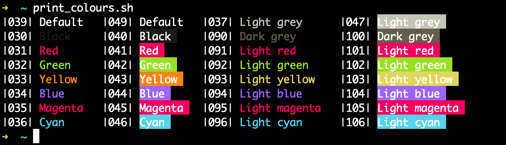

# Monokai Charcoal Theme for Alacritty

Inspired by [Monokai Charcoal Theme for VSCode](https://github.com/74th/vscode-monokaicharcoal).  

Clone [monokai_charcoal_white.yaml](monokai_charcoal_white.yaml) into your `$HOME/.alacritty/` directory or copy the contents of [monokai_charcoal_white.yaml](monokai_charcoal_white.yaml) into your `alacritty.yaml` config file.  

## ~~License~~ Licence

This theme is licensed under WTFPL, checkout out [~~LICENSE~~ LICENCE](LICENSE).
